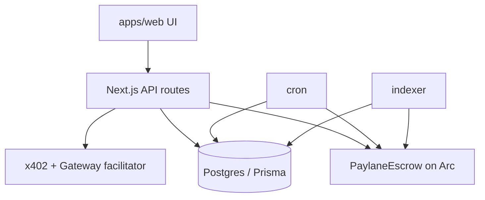

# Architecture

**Version:** 1.0.0 · **Last updated:** 2026-07-28

## Monorepo

```
workpay/
  apps/web              Next.js 15 App Router
  packages/contracts    Foundry escrow
  packages/shared       enums, zod, money helpers
  examples/agent-buyer
  examples/paid-api-seller
  services/indexer      event → DB
  services/cron         auto-release, deadlines, reconcile
  docs/                 source markdown (also served in-app)
```

## System diagram



## Mode A flow

Client create → publish → approve/fund → assign → deliver → accept | revision | dispute | auto-release.

## Mode B flow

Seller registers resource → buyer 402 → Gateway pay → verify → respond → receipt + usage.
