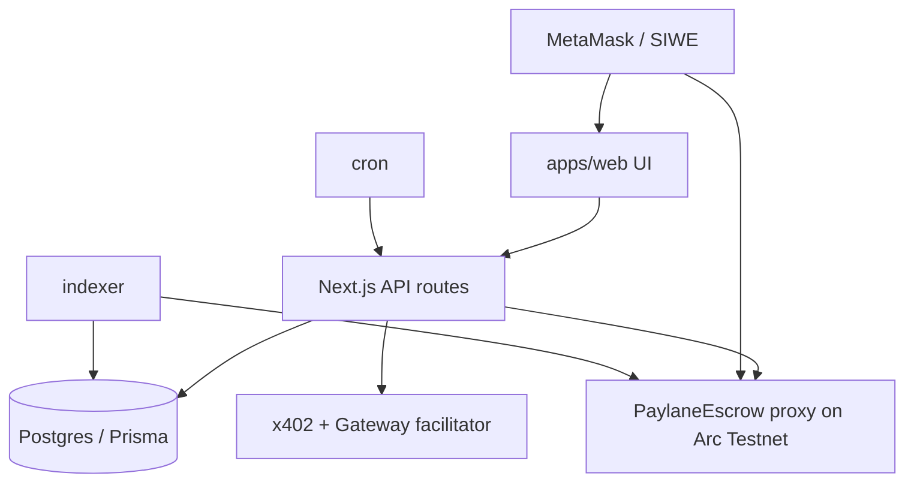

# Architecture

**Version:** 1.1.0 · **Last updated:** 2026-08-20

## Monorepo

```
paylane/
  apps/web              Next.js 15 App Router + Prisma
  packages/contracts    PaylaneEscrow (Foundry) + deployments/
  packages/shared       enums, zod, money helpers
  examples/agent-buyer  Mode B demo
  docs/                 source markdown (served at /docs)
  services/indexer      event → DB (stub)
  services/cron         auto-release, deadlines
```

## System diagram



## Live Arc Testnet addresses

| Component | Address |
|-----------|---------|
| Escrow proxy | `0x144762e02f9676593D955CF0d184323474C79805` |
| USDC ERC-20 | `0x3600000000000000000000000000000000000000` |
| Chain ID | `5042002` |

## Mode A flow

Client create → publish → approve USDC → createJob + fundJob → assign → deliver (`markDelivered`) → accept | revision | dispute | auto-release.

Platform fee **0.1%** applied on-chain at release (`platformFeeBps = 10`).

## Mode B flow

Seller registers resource → buyer 402 → pay proof → verify → respond → receipt + usage.

## Config layers

| Layer | Source |
|-------|--------|
| Chain / escrow | `apps/web/src/lib/networks.ts` + env |
| Fee / review rules | `PLATFORM_FEE_BPS` etc. in env → `/api/config` |
| Demo vs live | `DEMO_MODE=false` + escrow address → always live |
