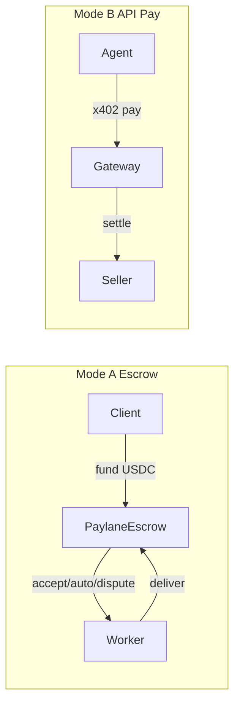

# For Officials — Arc / Circle Alignment

**Version:** 1.0.0 · **Last updated:** 2026-07-28

## Problem

Freelance work and machine-to-machine API calls need **dollar settlement** with clear protections — without custodial omnibus wallets or a speculative platform token.

## Solution

**Paylane** on Arc:

- **Mode A:** Non-custodial USDC escrow smart contracts for human jobs
- **Mode B:** x402 + Circle Gateway Nanopayments for agent/API micropayments
- In-app Trust Center for users and ecosystem officials

## Arc-native settlement

- Primary network: **Arc testnet** (MVP) → Arc mainnet via config
- Unit of account: **USDC**
- Explorers linked from receipts

## Circle product integrations

| Integration | Use |
|-------------|-----|
| USDC | Settlement asset |
| Arc | Chain |
| Escrow contracts | Mode A lock/release |
| x402 | HTTP 402 payment challenges |
| Gateway Nanopayments | Batched gas-efficient agent pay (`@circle-fin/x402-batching` patterns) |
| Wallets | EVM / Circle-friendly SIWE auth |

## Safety model

- Escrow before work; auto-release; disputes; no owner-steal
- API pay: verify-before-response; credits on seller 5xx
- Audit logs + unified receipts

## Traction metrics (placeholders)

| Metric | Value |
|--------|-------|
| USDC volume (testnet) | — |
| Jobs completed | — |
| API paid calls | — |
| Active wallets | — |

## Mainnet path

See [MAINNET_CHECKLIST](./MAINNET_CHECKLIST.md). Non-custodial design expands **USDC utility on Arc** for both human work and agent commerce without requiring LP/TVL products.

