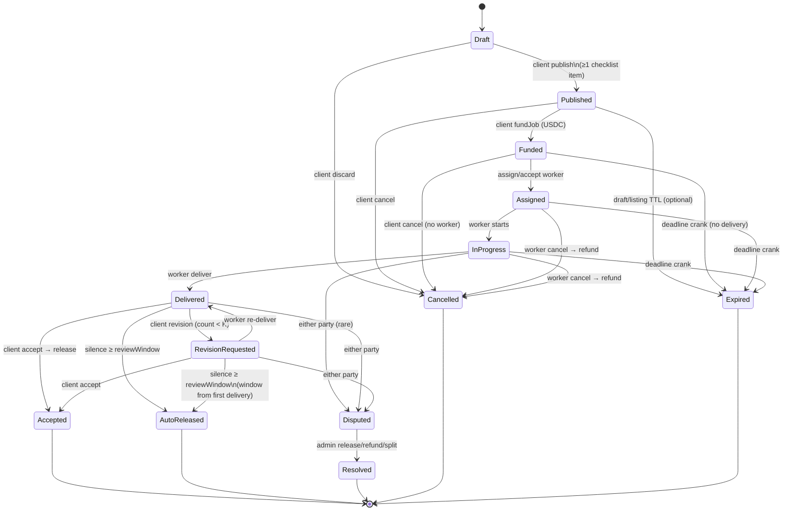

# Paylane Freelance Job State Machine (Mode A)

**Version:** 1.1.0  
**Last updated:** 2026-08-20  
**Related:** `CONTRACT_SPEC.md`, `MONEY_RULES.md`, `DISPUTE_POLICY.md`

This is the full off-chain + on-chain state machine for Mode A (freelance escrow). Mode B (API pay) has **no** escrow states — see `MONEY_RULES.md`.

---

## 1. States

| State | On-chain? | Money | Description |
|-------|-----------|-------|-------------|
| `Draft` | No | — | Client editing job + checklist |
| `Published` | No | — | Visible listing; not funded |
| `Funded` | Yes `Funded` | USDC locked | Escrow confirmed |
| `Assigned` | Yes `Funded` | Locked | Worker accepted / assigned |
| `InProgress` | Yes `Funded` | Locked | Work underway |
| `Delivered` | Yes `Delivered` | Locked | Artifacts submitted; review clock starts |
| `RevisionRequested` | Yes `Delivered` | Locked | Client asked changes (≤ K) |
| `Accepted` | Yes `Accepted` | Released to worker − fee | Terminal success |
| `Disputed` | Yes `Disputed` | Frozen | Auto-release paused |
| `Resolved` | Yes `Resolved` | Per admin split | Terminal |
| `AutoReleased` | Yes `AutoReleased` | Released to worker − fee | Terminal (silence) |
| `Cancelled` | Yes `Cancelled` | Refunded if funded | Terminal |
| `Expired` | Yes `Expired` | Refunded | Deadline miss |
| `Refunded` | Alias of cancel/expire refund complete | — | Ledger label |

---

## 2. Diagram

---

## 3. Defaults (configurable via env)

| Key | Default | Bounds |
|-----|---------|--------|
| `PLATFORM_FEE_BPS` | 10 (0.1%) | 0–1000 |
| `REVIEW_WINDOW_HOURS` | 72 (3 days) | 24–168 |
| `REVISION_LIMIT` | 2 | 0–5 |
| `DISPUTE_EVIDENCE_HOURS` | 72 | 24–168 |
| `UNFUNDED_LISTING_TTL_DAYS` | 30 | optional |
| `DEADLINE_EXTENSION` | mutual agree | off-chain + optional new deadline tx later |

---

## 4. Transition table

Legend: **C** client, **W** worker, **A** admin/arbitrator, **S** system/crank, **Any** permissionless.

| From | To | Actor | Guards | Side effects |
|------|----|-------|--------|--------------|
| Draft | Published | C | ≥1 acceptance criterion; title; amount > 0 | audit, notify |
| Draft | Cancelled | C | — | audit |
| Published | Funded | C | approve+fundJob; correct USDC+chain | escrow lock; receipt; audit; notify |
| Published | Cancelled | C | — | audit |
| Funded | Assigned | C or W accept | worker wallet set; escrow funded | audit; notify |
| Funded | Cancelled | C | worker unset | full refund; receipt |
| Funded | Expired | S/Any | past deadline; not delivered | full refund |
| Assigned | InProgress | W | — | audit |
| Assigned/InProgress | Cancelled | W | not delivered | full refund; reputation penalty |
| Assigned/InProgress | Expired | S/Any | past deadline | full refund |
| InProgress | Delivered | W | ≥1 artifact or hash; escrow funded | markDelivered; start review clock; notify |
| Delivered | RevisionRequested | C | revisionsUsed < K; reason + checklist issues | revisionsUsed++; audit; notify |
| Delivered/RevisionRequested | Delivered | W | re-upload allowed | audit; **review window does not reset** |
| Delivered/RevisionRequested | Accepted | C | — | accept tx; fee; receipts; ratings unlocked |
| Delivered/RevisionRequested | Disputed | C or W | evidence window opens | openDispute; freeze auto-release |
| Delivered/RevisionRequested | AutoReleased | S/Any | now ≥ deliveredAt + reviewWindow; not disputed | autoRelease; fee; receipts |
| Disputed | Resolved | A | evidence deadline passed or both submitted; amounts sum to escrow | resolveDispute; receipts; final |
| * | * | — | wrong actor / paused / wrong network | **reject**; no state change |

### Blocked transitions (examples)
- Start InProgress without Funded escrow → **reject**
- 3rd revision when K=2 → **reject** (Accept or Dispute only)
- Dispute after AutoReleased/Accepted → **reject**
- Double accept → **reject** (idempotent; no double-pay)
- Cancel after Delivered → **reject**
- Non-party wallet acting → **reject**

---

## 5. Timers

| Timer | Starts | Duration | On expiry |
|-------|--------|----------|-----------|
| Review / auto-release | First `Delivered` (`deliveredAt`) | `REVIEW_WINDOW_HOURS` | `autoRelease` crank |
| Job deadline | Job create/fund | client-set | `expireRefund` if not delivered |
| Dispute evidence | `Disputed` | `DISPUTE_EVIDENCE_HOURS` | admin may decide; late evidence discretionary |
| Unfunded listing TTL | Published | 30d default | Cancelled/Expired listing |

Cron emits warnings at T-24h and T-6h for deadline and auto-release.

---

## 6. Permissions matrix (summary)

| Action | Draft | Published | Funded | Assigned | InProgress | Delivered | RevReq | Disputed |
|--------|-------|-----------|--------|----------|------------|-----------|--------|----------|
| Edit job | C | C* | — | — | — | — | — | — |
| Fund | — | C | — | — | — | — | — | — |
| Assign/Accept | — | — | C/W | — | — | — | — | — |
| Deliver | — | — | — | W | W | W† | W | — |
| Accept | — | — | — | — | — | C | C | — |
| Revision | — | — | — | — | — | C | — | — |
| Dispute | — | — | ‡ | ‡ | ‡ | C/W | C/W | — |
| Resolve | — | — | — | — | — | — | — | A |
| Auto-release | — | — | — | — | — | Any | Any | — |
| Cancel | C | C | C§/W | W | W | — | — | — |

\* Limited fields after publish.  
† Re-deliver after revision.  
‡ Dispute from Funded/Assigned/InProgress allowed only for fraud/no-show edge cases; MVP UI emphasizes Delivered+.  
§ Client cancel only if worker unset.

---

## 7. Audit & notifications (every transition)

1. Validate actor role + wallet match
2. Validate timing + escrow status (DB + optional chain read)
3. Apply transition in DB transaction (idempotency key)
4. Write `AuditLog`
5. Write `LedgerEntry` / receipt if money moved
6. Notify counterparties (in-app; email optional)

---

## 8. Mode separation

| Concern | Mode A | Mode B |
|---------|--------|--------|
| States above | Yes | No |
| Escrow | Yes | No |
| Accept / dispute / auto-release | Yes | No |
| Payment model | Lock → release | Instant access-for-payment (x402) |

UI must never mix Mode A dispute UX into Mode B successful API responses (non-disputable by default).
